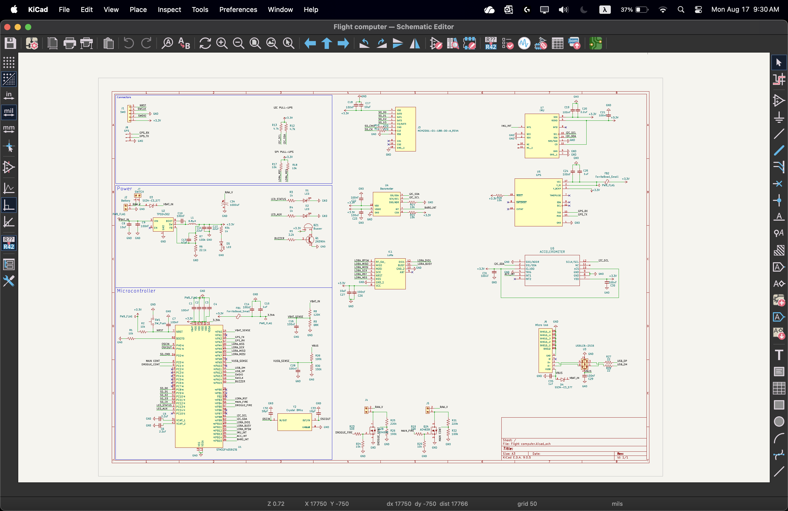
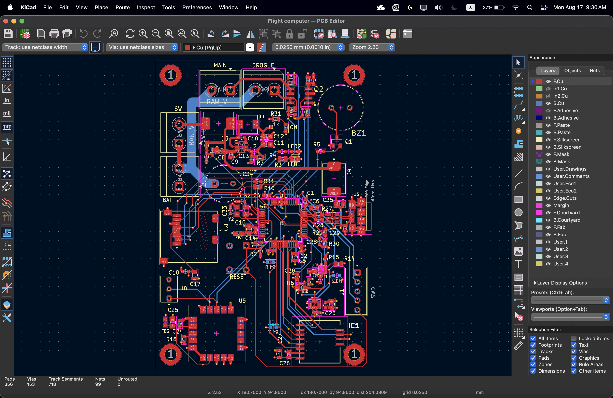

# Rocket Flight Computer

A custom STM32F405-based flight computer designed and built for my Level 2 high-power rocket.

The system integrates an IMU, barometer, GPS receiver, microSD storage, and USB interface on a custom PCB. I developed the embedded firmware in C for sensor acquisition, calibration, data logging, and real-time estimation of altitude and vertical velocity.

The flight computer has completed integrated ground testing and is currently being prepared for its first flight.

<p align="center">
  
</p>

---

## Hardware Design

The flight computer is built around an STM32F405 microcontroller. I designed the board to integrate the sensing, storage, and communication hardware required for flight onto a single PCB rather than using separate development boards.

The main hardware includes:

- STM32F405 microcontroller
- BMP581 barometer
- LSM6DSO32 accelerometer and gyroscope
- GPS receiver
- microSD card
- USB interface

The BMP581 and LSM6DSO32 communicate with the STM32 over I²C, the GPS receiver uses UART, and flight data is written to the microSD card through SDIO.

### Schematic

<p align="center">
  
</p>

### PCB Layout

<p align="center">
  
</p>

---

## Firmware

The firmware is written in C and organized into separate modules for the major subsystems:

```text
bmp581.c / bmp581.h
imu.c / imu.h
gps.c / gps.h
sd_logger.c / sd_logger.h
vertical_filter.c / vertical_filter.h
```

I developed the code for sensor acquisition, GPS communication, microSD logging, USB debugging, calibration, and vertical-state estimation.

The main application continuously reads the onboard sensors, updates the altitude and vertical-velocity estimate, records the data to the microSD card, and provides live output over USB during testing.

---

## State Estimation

The flight computer estimates the rocket's altitude and vertical velocity in real time using data from the barometer and accelerometer.

Barometric altitude provides an absolute measurement of altitude, but it contains measurement noise. Accelerometer data responds much faster to changes in motion, but integrating acceleration causes errors to accumulate over time.

To combine the advantages of both measurements, I implemented a linear Kalman filter.

The estimator tracks two states:

```text
altitude
vertical velocity
```

Acceleration is used during the prediction step to estimate how the rocket's vertical state changes between measurements. Barometric altitude is then used to correct the estimate.

This allows the flight computer to maintain a continuous estimate of the rocket's vertical motion without relying entirely on either sensor.

---

## Data Logging

Flight data is recorded to an onboard microSD card in CSV format using the STM32 SDIO interface and FatFs.

The logs contain raw sensor measurements together with the estimated altitude and vertical velocity, allowing the flight to be analyzed after recovery.

Example ground-test logs are included in the `Logs/` directory.

The logged data can also be processed in Python for visualization and analysis.

---

## Hardware and Firmware Bring-Up

A significant part of the project involved debugging the interaction between the custom PCB and the embedded firmware.

I brought up the system incrementally, testing individual subsystems before running the complete flight software.

This included:

- verifying communication with the BMP581 and LSM6DSO32
- configuring and testing the GPS UART interface
- calibrating sensor measurements
- bringing up USB CDC for live debugging
- initializing the microSD card through SDIO
- creating and writing files using FatFs
- validating continuous CSV logging
- integrating the vertical-state estimator with the sensor pipeline

The microSD interface was one of the more challenging parts of the bring-up. Debugging required checking both the physical SDIO connections and the STM32 configuration before reliable file creation and continuous logging were achieved.

Once the individual subsystems were working independently, I integrated them into the complete flight-computer firmware and tested them simultaneously.

---

## Ground Testing

The complete system has been tested with the major hardware and firmware components operating together.

During ground testing, the flight computer continuously acquires IMU and barometer measurements, receives GPS data, updates the vertical-state estimator, writes data to the microSD card, and outputs debugging information through USB.

These tests were used to verify the full data path from the physical sensors through the firmware and finally to the recorded CSV files.

---

`Hardware/` contains the PCB design documentation, `firmware/` contains the STM32 source code, and `Logs/` contains example datasets recorded during ground testing.

---

## Current Status

The flight computer is operational in ground testing.

The custom PCB, sensor acquisition, GPS communication, USB debugging, microSD logging, and vertical-state estimator have been integrated and tested together.

The next major step is to fly the system onboard my Level 2 rocket.

Data recorded during the first flight will be used to evaluate the altitude and vertical-velocity estimates under real flight conditions and tune the estimator for future launches.

---

## Tools and Technologies

**Hardware:** STM32F405, BMP581, LSM6DSO32, GPS, microSD

**Firmware:** C, STM32 HAL, FatFs

**Interfaces:** I²C, UART, SDIO, USB CDC

**Analysis:** Python
